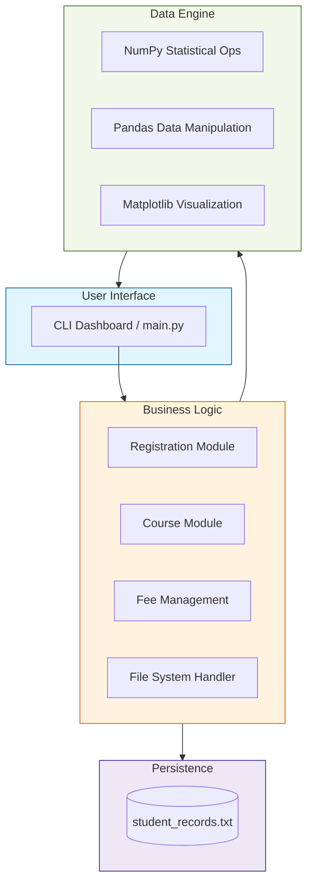
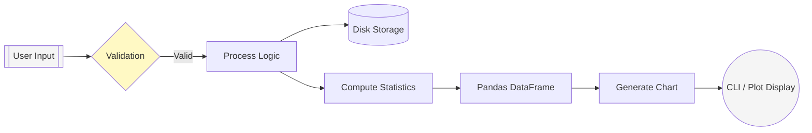

# Smart Campus Information System

<p align="center">
  
</p>

<p align="center">
  <a href="https://git.io/typing-svg"></a>
</p>

<p align="center">
  
  
  
  
</p>

---

## 🎥 System Demonstration

<p align="center">
  
  <br>
  <i>Note: Replace this with a recording of your terminal session using tools like 'Terminalizer' or 'ScreenToGif'.</i>
</p>

---

## 📖 Project Overview

The **Smart Campus Information System** is a command-line utility designed to streamline academic administrative tasks and provide quantitative insights into student performance. This project serves as a practical implementation of modular programming, persistent file storage, and data analysis using the Python ecosystem.

### Key Functionalities:
- **Record Management:** CRUD operations for student profiles and course enrollments.
- **Academic Evaluation:** Automated grade calculation based on subject averages.
- **Data Analytics:** Statistical analysis of class performance using NumPy and Pandas.
- **Visualization:** Generation of performance distribution graphs via Matplotlib.
- **System Utilities:** Automated directory scanning and persistent text-based storage.

---

## 🏗 Engineering Architecture

This system follows a modular layered architecture, ensuring separation of concerns between user interaction, business logic, and data persistence.



---

## 📊 Data Flow Diagram

The diagram below illustrates the lifecycle of student data from initial input to final analytical output.



---

## 🖼 Program Evidence

### Actual Application Interface

<p align="center">
  
  
</p>

### Sample Analytics Output

#### 🔹 NumPy Statistical Summary
```text
===== ANALYTICS =====
Highest Average : 94.5
Lowest Average  : 62.0
Class Average   : 78.25
```

#### 🔹 Pandas Data representation
| USN | Name | Average | Grade |
| :--- | :--- | :--- | :--- |
| 1DS22CS001 | Alice Johnson | 94.5 | A+ |
| 1DS22CS002 | Bob Smith | 72.0 | B |

#### 🔹 Matplotlib Visualization
<p align="center">
  
</p>

---

## 🚀 Future Roadmap

- [x] Core CRUD Operations
- [x] File Persistence (Text-based)
- [x] Statistical Analytics Integration
- [x] Basic Data Visualization
- [ ] **Phase 2:** SQLite/PostgreSQL Database Integration
- [ ] **Phase 3:** Multi-user Authentication System
- [ ] **Phase 4:** Flask/FastAPI Web Dashboard
- [ ] **Phase 5:** Automated Report Export (PDF/CSV)

---

## 💻 Development Workflow

### Technical Implementation Details
1. **Data Structures:** Uses a list of dictionaries for in-memory data management during sessions.
2. **Sorting Logic:** Implements Python's Timsort (via `sorted()`) with lambda keys for ranking students by GPA/Average.
3. **Analytics Engine:** 
   - **NumPy:** Leverages vectorized operations to calculate class-wide metrics.
   - **Pandas:** Converts raw dictionaries into DataFrames for structured reporting.
4. **Persistence:** Implements a comma-separated text storage system with exception handling for file availability and permission errors.

### Educational Value
This project demonstrates proficiency in:
- Modular function design
- Error and Exception handling
- File I/O operations
- Data manipulation with external libraries
- Operating system interactions (OS module)

---

## 🛠 Setup & Requirements

### System Requirements
- **OS:** Windows 10/11, macOS, or Linux.
- **Python:** 3.8 or higher.
- **Memory:** 512MB RAM (Minimum).
- **Disk:** 10MB available space.

### Installation
```bash
# Clone the repository
git clone https://github.com/subhamsje/SMART-CAMPUS-INFORMATION-SYSTEM.git

# Initialize environment
cd SMART-CAMPUS-INFORMATION-SYSTEM
python -m venv venv
source venv/bin/activate  # Windows: venv\Scripts\activate

# Install dependencies
pip install -r requirements.txt

# Run application
python main.py
```

### Troubleshooting
- **ModuleNotFoundError:** Ensure the virtual environment is active and `pip install` was successful.
- **Matplotlib Backend:** If running on a headless server (WSL without X-server), Matplotlib may require a non-interactive backend (e.g., `Agg`).
- **File Permissions:** Ensure the application has write access to the directory for `student_records.txt`.

---

## 📂 Repository Structure

```text
.
├── main.py               # Application entry point & CLI logic
├── requirements.txt      # List of Python dependencies
├── .gitignore            # Git exclusion rules
├── assets/               # Screenshots, GIFs, and media
│   └── .gitkeep
└── README.md             # Project documentation
```

---

## 📈 GitHub Stats

<p align="center">
  
  
</p>

---

## 🤝 Contribution & License

Contributions are welcome! If you'd like to improve the system or add new features, please fork the repository and create a pull request.

**License:** Distributed under the MIT License. See `LICENSE` for more information.

<p align="center">
  <b>Developed by <a href="https://github.com/subhamsje">Subham</a></b><br>
  <a href="https://www.linkedin.com/in/subhamsje">LinkedIn</a> • <a href="https://github.com/subhamsje/SMART-CAMPUS-INFORMATION-SYSTEM">Repository</a>
</p>

<p align="center">
  
</p>
