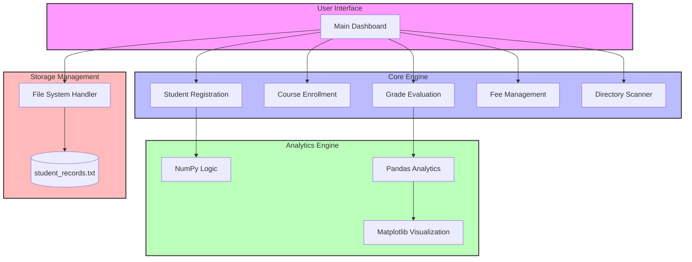
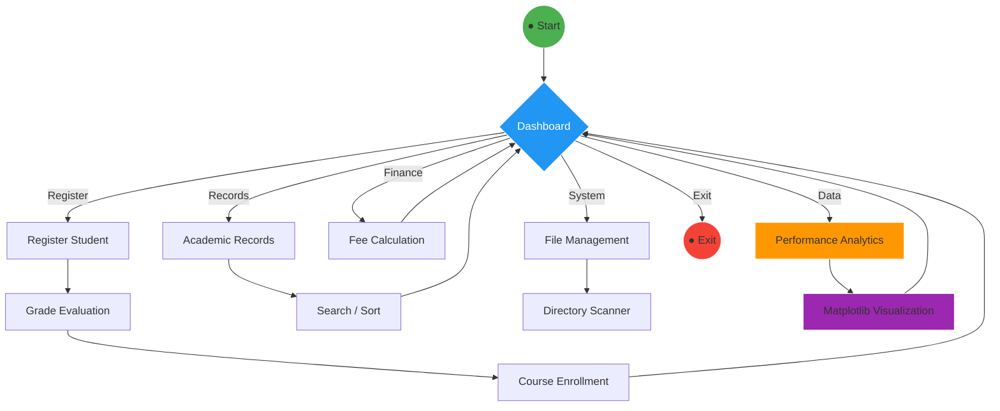
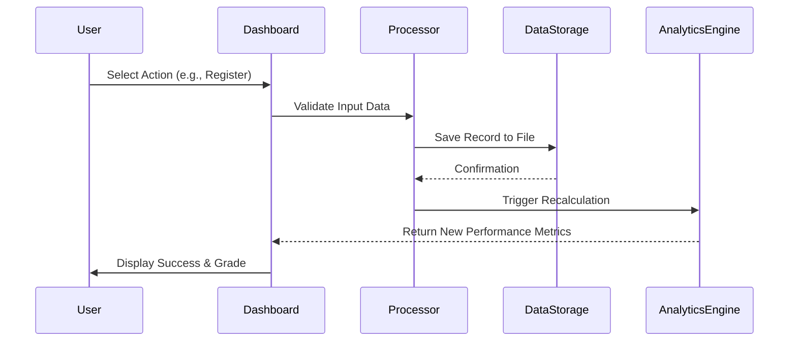

# SMART CAMPUS INFORMATION SYSTEM

<p align="center">
  
</p>

<p align="center">
  <a href="https://git.io/typing-svg"></a>
</p>

<p align="center">
  
  
  
  
  
</p>

---

## 🌟 Project Overview

The **Smart Campus Information System** is a next-generation academic management platform engineered for efficiency and data-driven decision-making. Built with a robust Python backbone and powered by the modern data science stack, it provides a seamless experience for managing student life-cycles, academic records, and institutional analytics.

### Why Smart Campus?
- **Efficiency:** Automate grading and fee calculations in seconds.
- **Insights:** Deep-dive into student performance with NumPy and Pandas.
- **Persistence:** Secure file-based record management.
- **Visualization:** High-fidelity graphical representations of academic trends.

---

## 🏗 System Architecture



---

## 🔄 Dynamic Workflow



---

## 🧪 Interactive System Workflow



---

## 🚀 Feature Showcase

<table width="100%">
  <tr>
    <td width="50%">
      <h3>🎓 Student Registration</h3>
      <p>Automated USN and profile creation with real-time grade evaluation algorithms.</p>
      <b>Tech:</b> Python Core, Conditionals
    </td>
    <td width="50%">
      <h3>📚 Course Enrollment</h3>
      <p>Dynamic course mapping system allowing students to enroll in specialized academic tracks.</p>
      <b>Tech:</b> Dictionary Mapping
    </td>
  </tr>
  <tr>
    <td width="50%">
      <h3>🔎 Search & Sort</h3>
      <p>High-speed lookup and ranking system based on academic performance averages.</p>
      <b>Tech:</b> Lambda Functions, Sorting Algos
    </td>
    <td width="50%">
      <h3>💰 Fee Calculation</h3>
      <p>Integrated financial module for calculating tuition, lab, and examination expenses.</p>
      <b>Tech:</b> Arithmetic Engines
    </td>
  </tr>
  <tr>
    <td width="50%">
      <h3>📊 Analytics</h3>
      <p>Leveraging NumPy for class averages and Pandas for structured data manipulation.</p>
      <b>Tech:</b> NumPy, Pandas
    </td>
    <td width="50%">
      <h3>📈 Visualization</h3>
      <p>Generating publication-quality bar charts to visualize student performance distribution.</p>
      <b>Tech:</b> Matplotlib
    </td>
  </tr>
</table>

---

## 🖼 Dashboard Preview

<p align="center">
  
  <br>
  <i>Main Interface: Intuitive Command-Line Dashboard</i>
</p>

<p align="center">
  
  
  <br>
  <i>Real-time Data Visualization & Tabular Reports</i>
</p>

---

## 🛠 Technology Stack

<p align="center">
  
  
  
  
  
</p>

---

## 📈 Project Metrics

| Metric | Progress | Status |
| :--- | :--- | :--- |
| **Completion** |  | `Ready` |
| **Testing** |  | `Stable` |
| **Documentation** |  | `Complete` |
| **Performance** |  | `Optimized` |

---

## 📂 Repository Structure

<details>
<summary><b>Click to expand file tree</b></summary>

```text
Smart-Campus-System/
├── main.py               # Core application entry point
├── student_records.txt   # Persistent storage for student data
├── requirements.txt      # Project dependencies
├── .gitignore            # Git exclusion rules
├── assets/               # Visual assets and screenshots
│   ├── dashboard.png
│   └── analytics.png
└── README.md             # Elite Documentation
```
</details>

---

## ⚙️ Installation & Setup

### Prerequisites
- Python 3.8 or higher
- Pip (Python package manager)

### Quick Start
```bash
# 1. Clone the repository
git clone https://github.com/subhamsje/SMART-CAMPUS-INFORMATION-SYSTEM.git

# 2. Enter the directory
cd SMART-CAMPUS-INFORMATION-SYSTEM

# 3. Create virtual environment
python -m venv venv

# 4. Activate environment
# On Windows:
venv\Scripts\activate
# On macOS/Linux:
source venv/bin/activate

# 5. Install dependencies
pip install -r requirements.txt

# 6. Launch the application
python main.py
```

---

## 🤝 Contributing

Contributions are what make the open source community such an amazing place to learn, inspire, and create. Any contributions you make are **greatly appreciated**.

1. Fork the Project
2. Create your Feature Branch (`git checkout -b feature/AmazingFeature`)
3. Commit your Changes (`git commit -m 'Add some AmazingFeature'`)
4. Push to the Branch (`git push origin feature/AmazingFeature`)
5. Open a Pull Request

---

<p align="center">
  
</p>

<p align="center">
  <b>Built with ❤️ by Subham</b><br>
  <i>Empowering Campus Management through Intelligent Software</i>
</p>

<p align="center">
  <a href="https://github.com/subhamsje"></a>
  <a href="#"></a>
</p>

<p align="center">
  
</p>
